# ActiveBreak Plugin   
a QGIS Plugin   

#_Occupational health_   

   <p align="center">
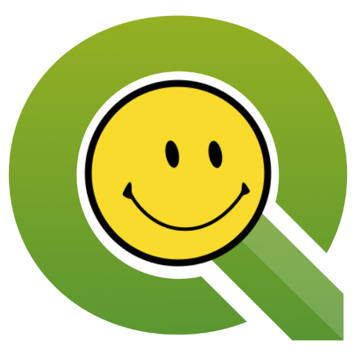
</p> 

## About plugin

Some of the consequences of an intense work day, the result of total immersion in the activity being carried out, are: not constantly saving the project, working more than two hours in a row in the same position or skipping lunch time. Over time, this situation goes against the health, morale and, ultimately, the productivity of the worker.

ActiveBreak is a plugin for QGIS that emits messages at the top of the canvas at time intervals from the start of work, reminding the user to take an active break, take their lunch and/or reminders indicating to save their QGIS project, depending on the time the message is broadcast. Additionally, it offers the user inspiring quotes from personalities related to the business, scientific, artistic, spiritual, social, political world, etc.

## Language

This plugin is write in Python programming language.

## Developer

The ActiveBreak plugin was developed by geologist Aldo Sardelli, with experience in the oil and gas industry, he has a master of science in oilfield characterization and development. Passionate about the GIS world, especially QGIS and the Python programming language.

## Social Media

- <b>LinkdIn:</b> <i>www.linkedin.com/in/geol-aldo-sardelli</i>
- <b>GitHub:</b>  <i>github.com/asardelli</i>
- <b>Twitter X:</b> <i>asardelli</i>
- <b>Mastodon:</b> <i>@asardelli@fosstodon.org</i>
- <b>YouTube:</b> <i>https://youtube.com/@asardelli?si=Um_zORJ-Cb9vaFy7</i>

## Installation

In the Plugin menu, select the Manage and install plugins... option, then a "Plugins" window is displayed.

   <p align="center">
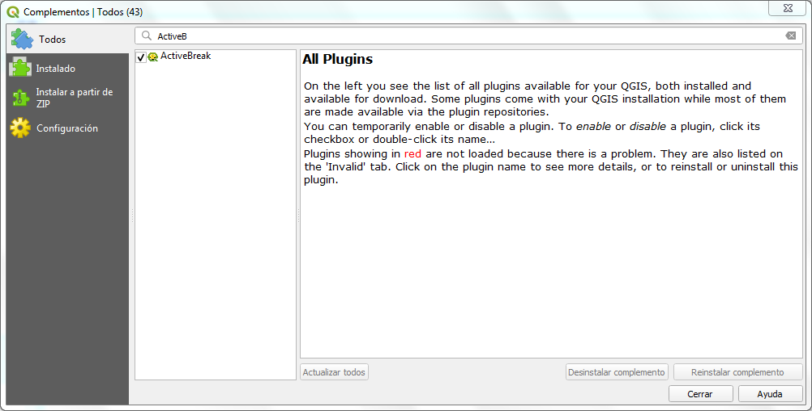
</p> 

Write the plugin name <b>ActiveBreak</b> in up part of the window, and push bottom Install Plugin.

<b>Right, The plugin is ready!</b>

## What does the plugin do?

1. Issues a Reminder message to take an active break - every 2 hours.
2. Issues a reminder message to save the project - intermediate between active pauses
3. It issues a message that it is time for lunch - between 12:00 and 13:00.
4. Present a message with a phrase from important people (artists, political figures, leaders)
5. It allows you to download the message and it is possible to personalize it.
6. When the plugin is active for more than 18 hours and a new workday starts, a message will be issued indicating this and with the option to reset the plugin. This option will also appear in reminders to take an active break and save the project. From 6:00 to 8:30.
7. A button that allows you to save changes to the project. This is incorporated into the notice to save the project, to take an active break and the one that indicates that it is time for lunch.

## Schedule

Messages will only be issued from 06:00 to 18:00, distributed as follows:

<B>06:00</B>

<p align="center">
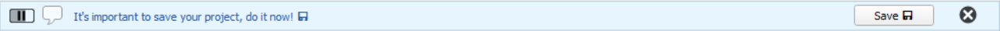  
</p> 

<p align="center">
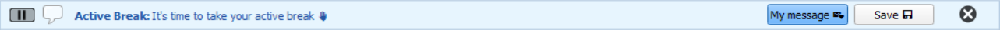  
</p> 

<B>12:00</B>

<p align="center">
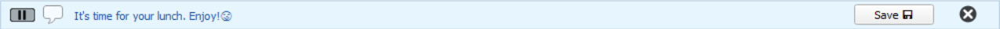  
</p> 

<B>13:00</B>

<p align="center">
  
</p> 

<p align="center">
  
</p> 

<B>18:00</B>

If the QGIS program and the ActiveBreak plugin are still active for the next working day, a message will begin to be issued from 06:00 to 08:30, with a frequency of 30 minutes, a message suggesting reloading the plugin in order to restart the chronometer. Likewise, the main messages of saving the project and taking an active pause will have a button to reload the plugin.

<B>06:00</B>

<p align="center">
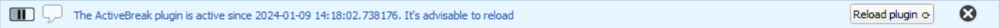  
</p> 

<p align="center">
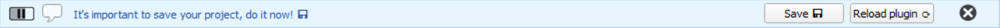  
</p> 

<p align="center">
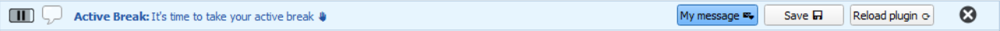  
</p> 

<B>08:30</B>

<div id='id1' />

The plugin starts the timer upon activation, but once the half-day of work has passed, a lag may occur, so after lunch is done, messages will have an additional button to reset the timer.

<B>13:00</B>

<p align="center">
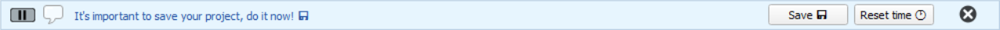  
</p> 

<p align="center">
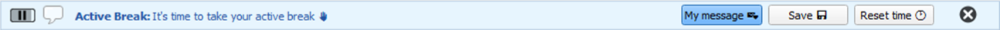  
</p> 

<B>14:30</B>

Outside of these hours, messages are not issued.

## Reset Time

The plugin starts the timer when it is activated, but once the half-day of work has passed, a gap may occur between the issuance of messages and the user's work reality. That is why the ActiveBreak plugin allows you to reset the timer.

There are two ways to do it, the first is through a button located in the Complement Menu, in the ActiveBreak submenu in the Reset Time button. See the following figure.

<p align="center">
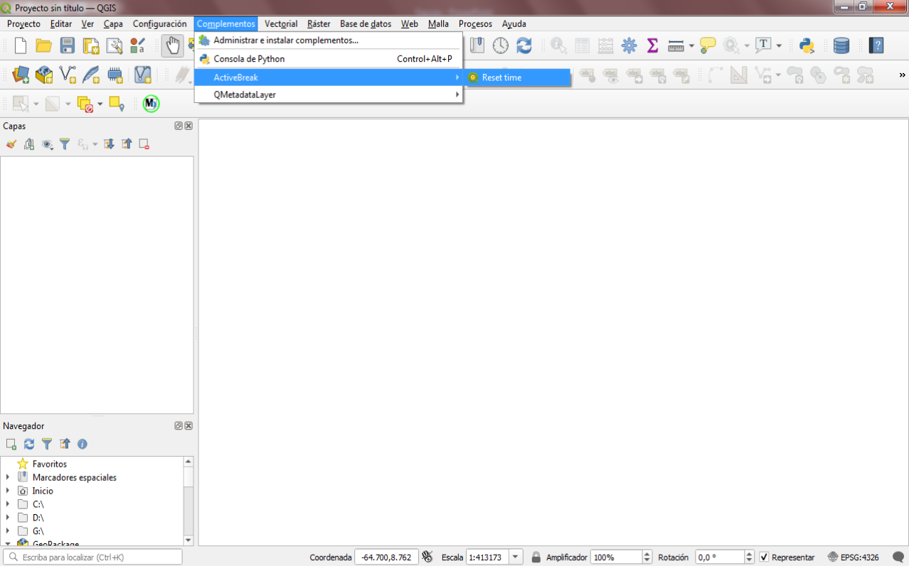  
</p>  

The other way is through a button in the messages at a set time, as explained [here](#id1)

## Frequency

- <b>Message 1:</b> <i>ActiveBreak. Set time from now  07:43:46!</i> Issued when activating the plugin or restarting time.
- <b>Message 2:</b> <i>"Active Break", It's time to take your active break"</i> is issued with a frequency of every 2 hours from the activation of the plugin and at the established time.
- <b>Message 3:</b> <i>It's important to save your project, do it now!</i> It is broadcast between the active pause messages.
- <b>Message 4:</b> <i>It's time for your lunch. Enjoy it!</i> replaces messages 2 and 3 at lunch time.
- <b>Message 5:</b> <i>“The ActiveBreak plugin is active since 2023-12-27 07:43:46.990523. It's advisable to reload.”</i> It is issued from 06:00 to 08:30 only if the complement has remained active since a previous workday, with a frequency of 30 minutes between messages 2 and/or 3.

## Sequence

The following model shows as an example the sequence in which the messages would appear if the plugin is activated at 8:15.

<p align="center">
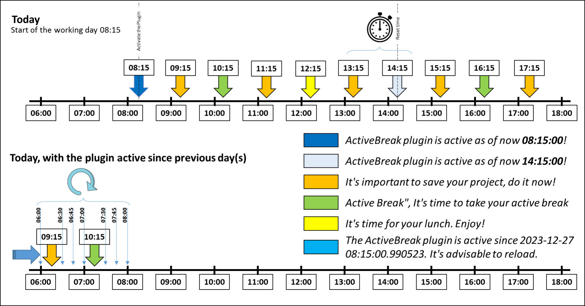  
</p>  

When activating the plugin, the messages would appear in the following sequence:
- •	Plugin activation, Message 1.
- At the first hour, message 3 would appear.
- At the second hour, message 2 would appear.
- At the third hour, message 3 would appear,
- At the fourth hour, it would be 12:15, message 4 would appear,
- At the fifth hour, message 3 would appear, with the time reset button.  
The complement stopwatch is restarted at the sixth hour (2:15 p.m.) and the established sequence is resumed.   
- At the seventh hour, message 3 appears.
- At the eighth hour, message 2 will appear.
- At the ninth (17:15) hour message 3.
The next time would be 6:15 p.m., but the schedule established in the add-on indicates that the work day ends at 6:00 p.m. and, therefore, from that time onwards, do not issue any more messages.  
The Example shows that QGIS and the plugin remained active until the next business day. Starting at 6:00 the day begins and the plugin issues messages again, but this time with a frequency of every quarter of an hour, with messages indicating that the plugin remained active from a previous day (message 5) and suggests restarting. the complement, for this it has a button to do it as well as the main messages until 8:30.  
Restarting the plugin, the sequence runs again as described above.

## How do messages appear?

The messages will appear at the top of the QGIS canvas according to the order and schedule established from the activation of the plugin or from the start of the work day.

### When activating the plugin or restarting time.

<p align="center">
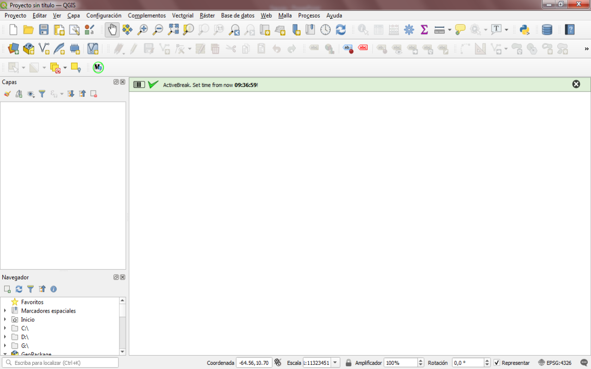  
</p>  

### Remember to save the project

There is always a button to save the project.

<b>Normal</b>

<p align="center">
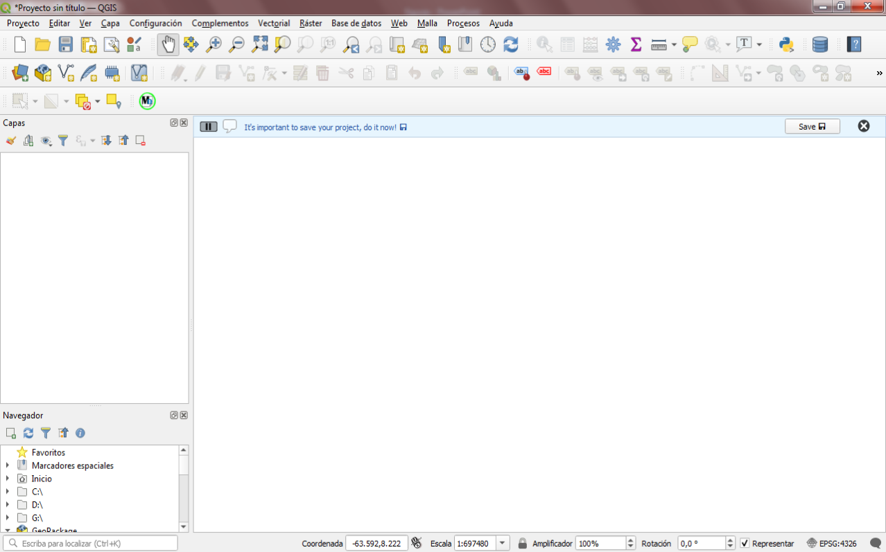  
</p>  

<b>With a plug-in reload button</b>

<p align="center">
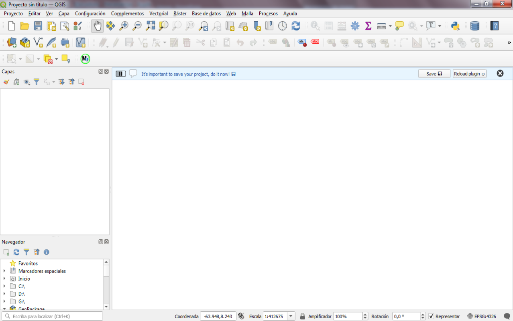  
</p>  

<b>With a reset time button</b>

<p align="center">
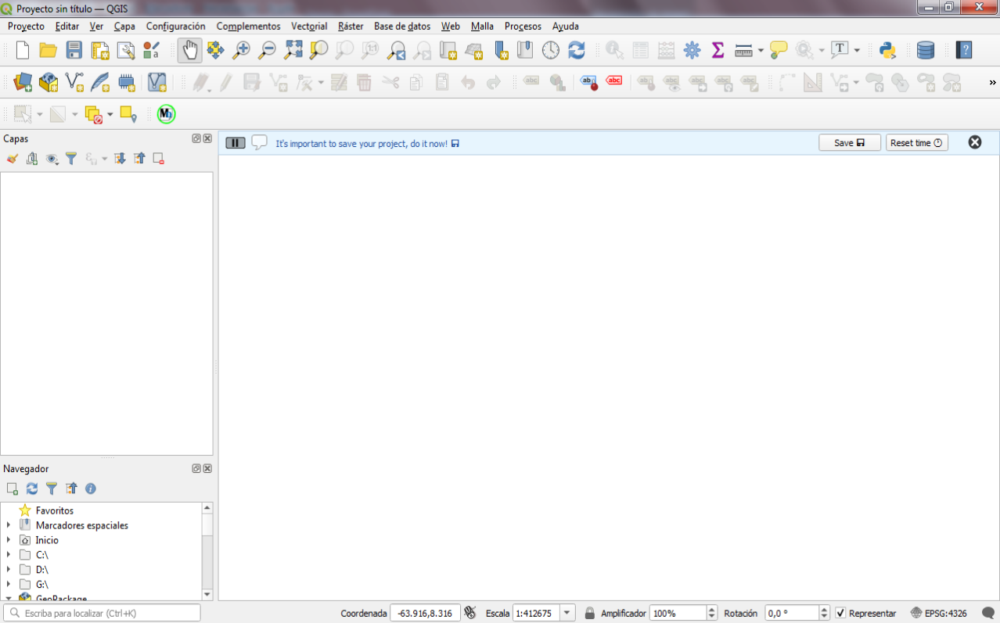  
</p>  

### Remember to take an active break

It always has two buttons, one with a quote from a famous person and another to save the project....

<b>Normal</b>

<p align="center">
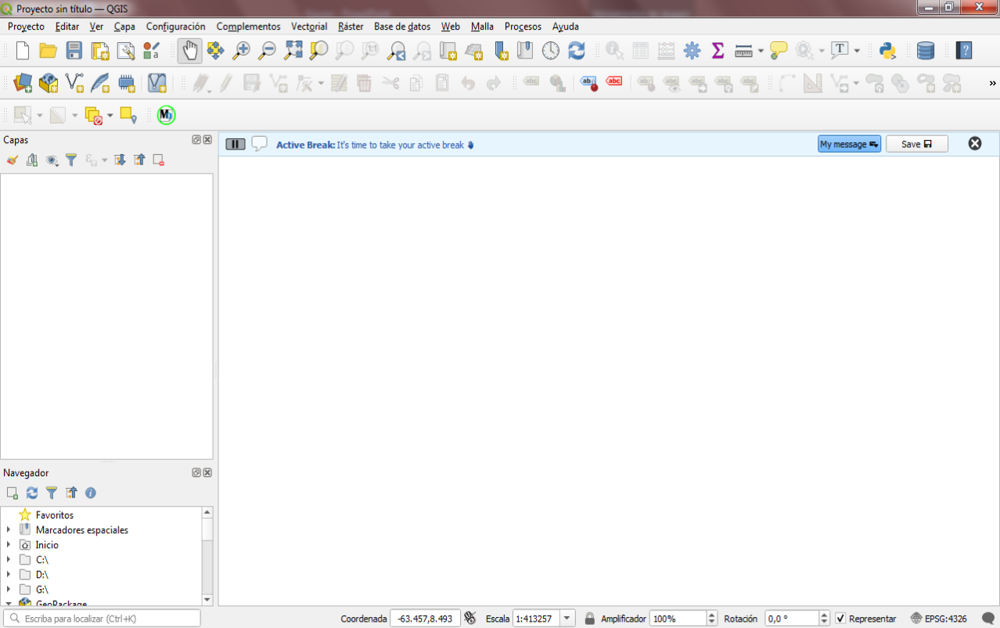  
</p>  

<b>With a plug-in reload button</b>

<p align="center">
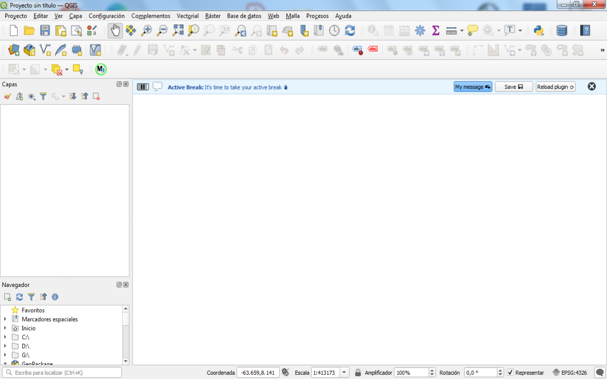  
</p>  

<b>With a reset time button</b>

<p align="center">
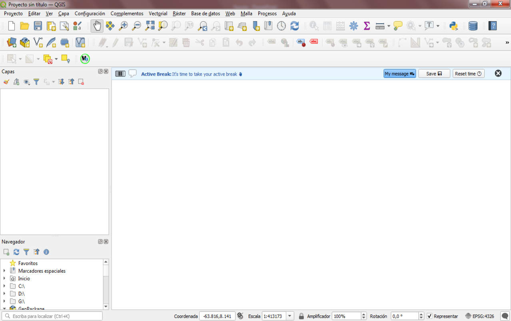  
</p>  

### Remember to have lunch

There is always a button to save the project.

<p align="center">
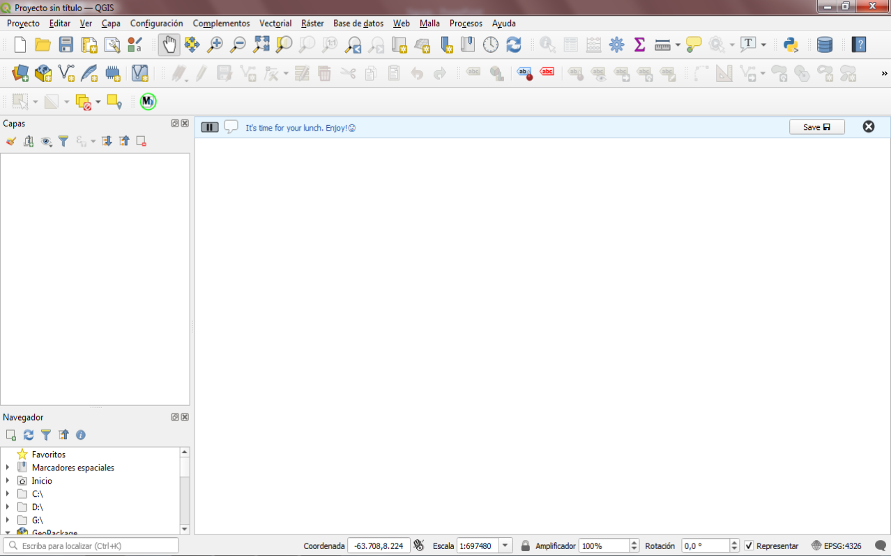  
</p>  

### Reload plugin (additional)

It always has a button to reload plugin

<p align="center">
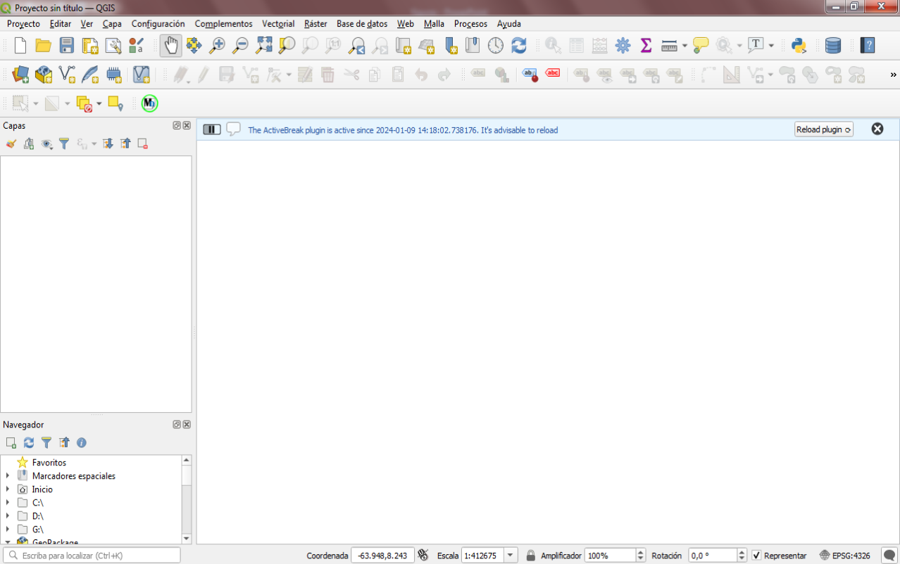  
</p>  

## Motivational quotes

The Activebreak complement offers motivating quotes; written or said by some leaders in different areas of society, such as: entrepreneurs, entrepreneurs, spiritual leaders, scientists, artists, politicians, among others. Many of them, with their actions, have positively influenced today's world. These phrases are messages aimed at motivating the user, bringing positive thoughts to their mind with the aim of maintaining their mental health.

### Quotes category

- Motivational phrases for entrepreneurs.
- Motivational phrase of the day.
- Inspirational quotes that motivate.
- Hurry motivational quotes.
- Motivational quotes for employees.
- Super motivating phrases.
- Motivational phrases for work.
- Phrase of the day for work.
- Encouraging quotes to motivate you.
- Motivational phrases for success.
- Motivational quotes for life.
- Business motivation quotes.
- General motivational quotes.
- You can do it quotes
- Motivational quotes about self confidence
- Famous motivational quotes.
- Motivational quotes from books.
- Motivational song lyrics.
- Funny motivational quotes
- Motivational quotes with deep meaning.
- Short success phrases
- Motivational quotes about change.
- Motivational quotes about success.
- Motivational quotes about time.
- Motivational quotes about life.
- Motivational phrases of the day.
- Motivational quotes about learning.
- Positive motivational quotes.
- Motivational quotes about winning.
- Motivational quotes to encourage action.

### Authors of quotes

A.A. Milne, A.C. Benson, Abraham Lincoln, Albert Einstein, Alexander Graham Bell, Alexandra of The Productivity Zone, Aly Raisman, Amit Kalantri, Anaïs Nin, Andrew Carnegie, Andy Grove, Angela Bassett, Angelina Jolie, Anne Frank, Anne Lamott, Arabic proverb, Ariana Huffington, Arianna Huffington, Aristotle, Arlan Hamilton, Arthur Ashe, Arthur C. Clarke, Ayn Rand, Babe Ruth, Barack Obama, Barbara Elaine Smith, Baz Luhrmann, Benjamin Franklin, Benjamin Hardy, Bill Gates, Bill Walsh, Billie Jean King, Bo Jackson, Brad Sugars, Brian Herbert, Brian Vaszily, Bruce Lee, Buddha, C.S. Lewis, Calvin Coolidge, Carl Sagan, Carol Burnett, Carrie Green, Catherine Pulsifier, Chantal Sutherland, Charles A. Jaffe, Charles R. Swindoll, Charlie Munger, Childish Gambino, Chinese Proverb, Chris Grosser, Chris Rock, Christine Caine, Cindy Gallop, Clayton M. Christensen, Coco Chanel, Colin R. Davis, Confucius, Constance Wu, Cormac McCarthy, Dalai Lama, Dalai Lama XIV, Dale Carnegie, Dave Carolan, David Axelrod, David Hurley, David Ogilvy, Debby Boone, Derek Jeter, Diane McLaren, Diane von Furstenberg, Dita Von Teese, Dolly Parton, Don Cheadle, Dorothy West, Douglas Adams, Dr. Dorothy Height, Dr. Irene C. Kassorla, Dr. Seuss, Dr. Wayne D. Dyer, Drake, Drew Houston, Earl Nightingale, Edmond Mbiaka, Edna Mode, Eleanor Roosevelt, Elon Musk, Epicurus, Erica Jong, Estée Lauder, Florence Nightingale, Frank Ocean, Frank Sinatra, Frederick Douglass, Frida Kahlo, G.K. Nielson, Gabby Douglas, Gary Vaynerchuk, George Addair, George Bernard Shaw, George Eliot, George Lorimer, George R.R. Martin, Gilbert K. Chesterton, Goethe, Gordon B. Hinckley, Grace Hopper, Groucho Marx, H. Jackson Brown Jr., Hans F. Hansen, Harper Lee, To Kill a Mockingbird, Helen Keller, Henry David Thoreau, Henry Ford, Herb Brooks, Herman Melville, Hillary Clinton, I Hope You Dance, Lee Ann Womack, I’ll be there. Floor, Isabel Allende, Isabelle Lafleche, It’s My Life, Bon Jovi, J.K. Rowling, J.R.R. Tolkien, Jack Welch, Jamie Foxx, Jane Goodall", Jason Fried, Jaymin Shah, Jay-Z, Jean-Francois Cope, Jennifer Lopez, Jenny Craig, Jesse Owens, Jessica Ennis, Jim Henson, Jim Rohn, Jimmy Johnson, Joe Girard, Joe Torre, Johann Wolfgang von Goethe, John C. Maxwell, John Cage, John D. Rockefeller, John F. Kennedy, John Wooden, Jordan Belfort, Joss Whedon, Joyce Meyers, K’wan, Kamari a.k.a. Lyrikal, Katharine Hepburn, Ken Poirot, Kenneth Goldsmith, Komal Kapoor, Kurt Cobain, Kurt Vonnegut, Kyle Chandler, Kylie Francis, Laird Hamilton, Lalah Deliah, Latin Proverb, Leah Busque, Leah LaBelle, Leo Tolstoy, Les Brown, Lewis Carroll, Leymah Gbowee, Lily Tomlin, Lou Holtz, Louise Hay, Lucille Ball, Lucius Annaeus Seneca, Mahatma Gandhi, Mandy Hale, Marcus Aurelius, Marcus Luttrell, Marcus Tullius Cicero, Margaret Mead, Maria Edgeworth, Marianne Williamson, Marie Forleo, Marilyn Monroe, Mario Andretti, Marissa Mayer, Mark Cuban, Mark Twain, Martha Graham, Martin Luther King Jr., Mary Anne Radmacher, Mary Kay Ash, Matt Haig, Maya Angelou, Melissa McCarthy, Mia Hamm, Michael Bublé, Michael Jordan, Michelangelo, Michele Ruiz, Michelle Obama, Mike Murdock, Mister Rogers, Miya Yamanouchi, Mortimer J. Adler, Mother Teresa, Muhammad Ali, Napoleon Hill, Natasha Bedingfield, Neil Gaiman, Nelson Mandela, Nicki Minaj, Nishan Panwar, Norman Vincent Peale, Octavia Butler, Oprah Winfrey, Oscar Wilde, Pablo Picasso, Patrick Lencioni, Paul Bryant, Paul Graham, Paulo Coelho, Paulo Coelho, The Alchemist, Pele, Pema Chodron, Princess Diana, Rachael Bermingham, Ralph Waldo Emerson, Raymond Joseph Teller, Reese Evans, Robert Frost, Robert T. Kiyosaki, Robin Sharma, Robin Williams, Roger H. Lincoln, Ross Simmonds, Roy T. Bennett, Rumi, Ruth Gordo, Sam Levenson, Sarah Dessen, Sarah J. Maas, Sheryl Sandberg, Shiv Khera, Shonda Rhimes, Simon Sinek, Socrates, Sonia Sotomayer, Sophia Amoruso, St. Jerome., Stanley McChrystal, Stephen Covey, Stephen King, Stephen R. Covey, Steve Furtick, Steve Jobs, Steve Martin, Steven Wright, Summer Sanders, Susan Fales-Hill, Suzy Kassem, Taylor Swift, Theodore Roosevelt, Thomas A. Edison, Thomas Aquinas, Thomas Edison, Thomas J. Watson, Thomas Jefferson, Tim Ferriss, Tim Notke, Tina Fey, Tobias Lütke, Tom Lehrer, Tony Gaskins, Tony Robbins, Try, Pink, Tsang Lindsay, Unknown, Ursula Burns, Vernon Sanders Law, Vince Lombardi, Vincent van Gogh, W. P. Kinsella, Wake Me Up, Avicii, Walt Disney, Walt Whitman, Walter Anderson, Warren Buffett, Wayne W. Dyer, Will Rogers, William Arthur Ward, William Cobbett, William James, William Penn, William Shakespeare, William W. Purkey, Winnie the Pooh, Winston Churchill, Yuri Kochiyama, Zig Ziglar.

### How to get my message?

When the message that remembers making an active pause appears, it will have a "my message" button. To access the quote you must press that button.

<p align="center">
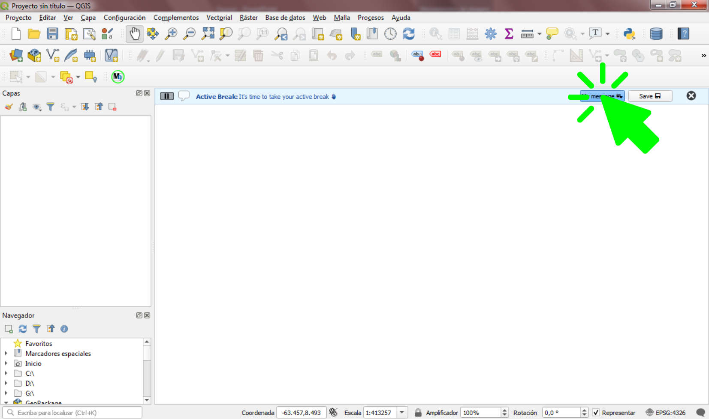  
</p>  

The message is randomly selected. The complement randomly selects one from a repository of 467 appointments.The mesanje is shown in an emerging window.

<p align="center">
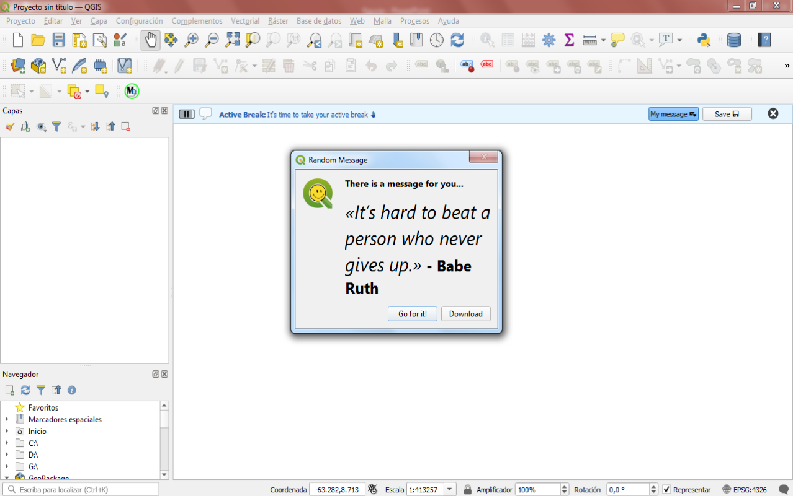  
</p>  

The message can be downloaded. To do this, you must press the "download" button, if not, you must press the "go for it" button to close the window.

<p align="center">
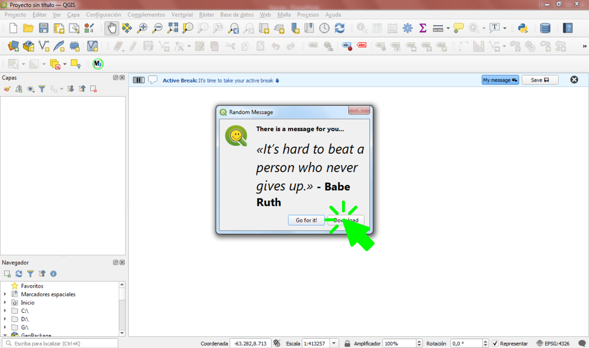  
</p>  

Once you press the "download" button, a message will appear if you want to add a person's name to the message.

### Personalized message

The message can be downloaded in a jpg image with a very special design that can be personalized by adding a recipient.Press the “OK” button.

<p align="center">
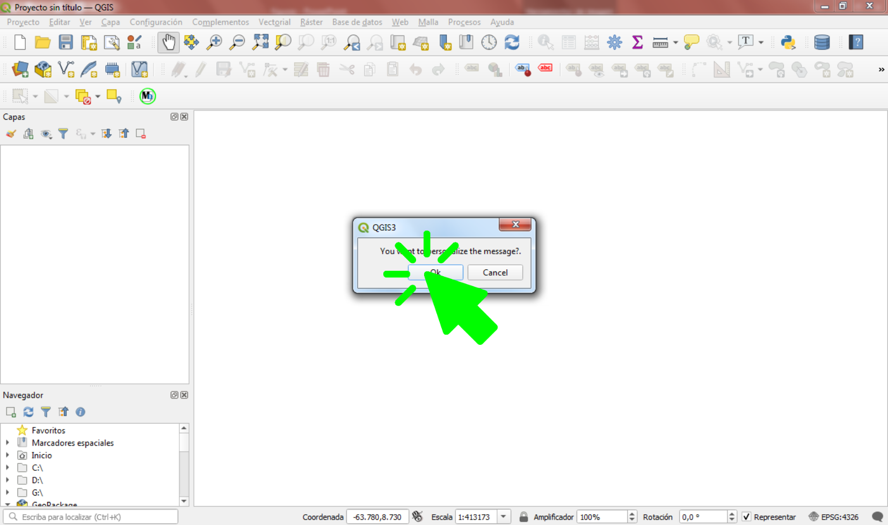  
</p>  

Another window will appear where you can type the person's name.

<p align="center">
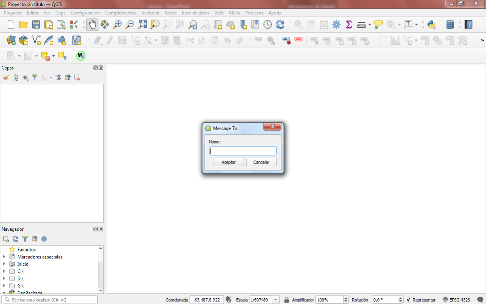  
</p>  

You add the name and press the accept button.

<p align="center">
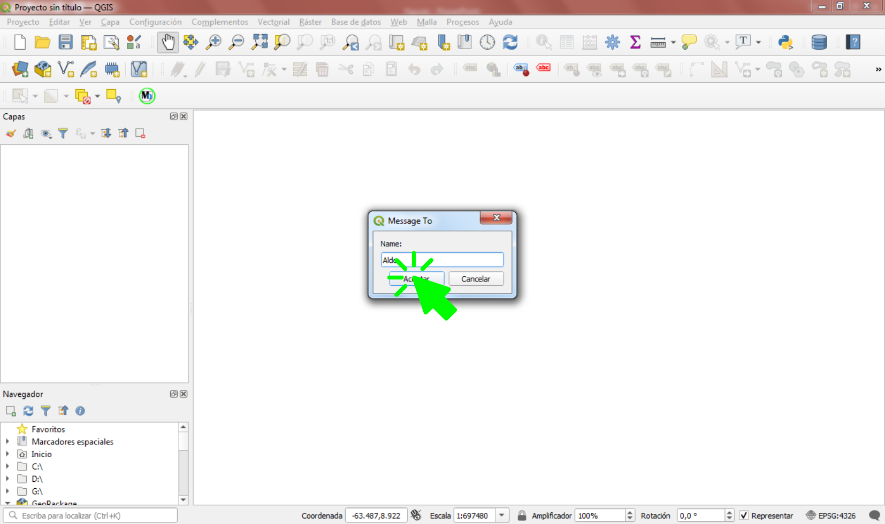  
</p>  

The message will be saved in the home directory of your computer.

<p align="center">
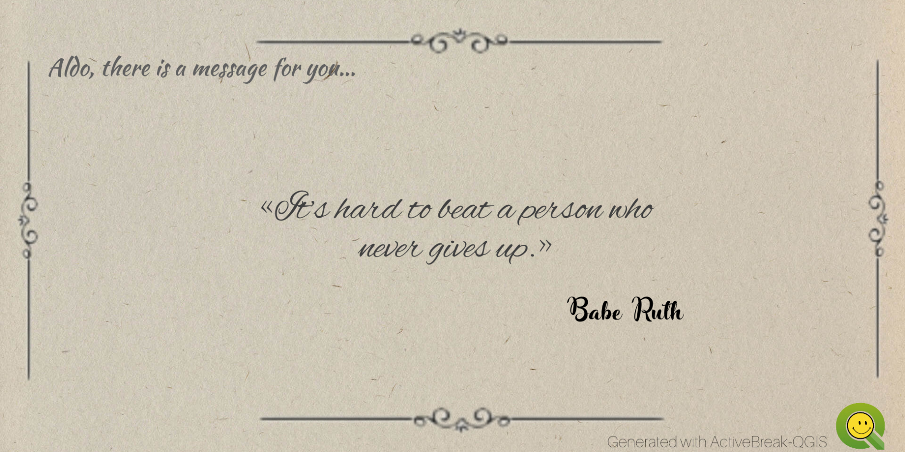  
</p>  

### Do not personalize the message

Press the “Cancel” button.

<p align="center">
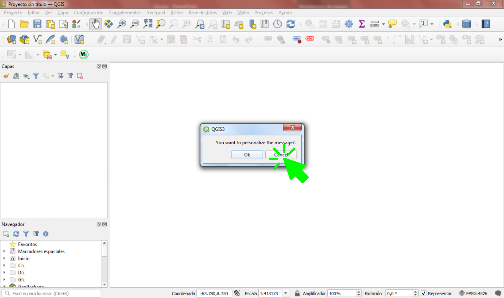  
</p>  

The message will be saved in the home directory of your computer.

<p align="center">
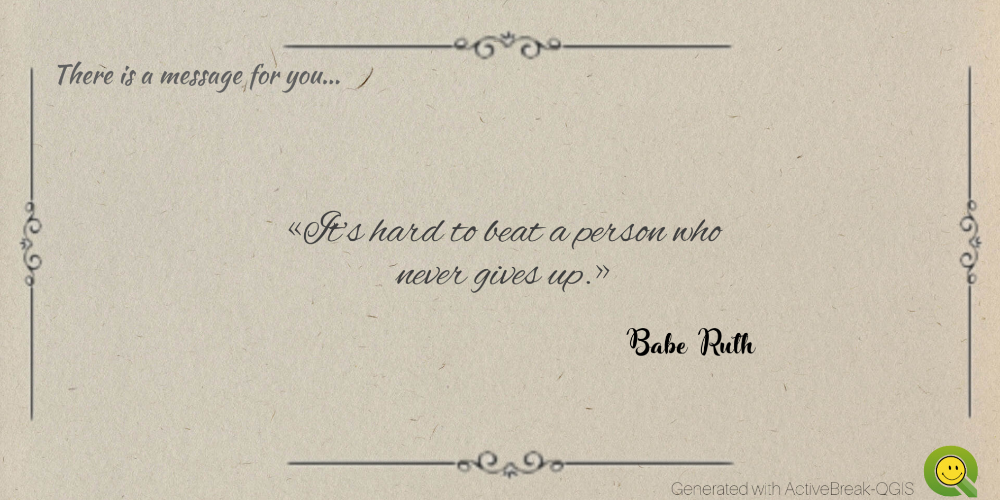  
</p>  


```python

```
